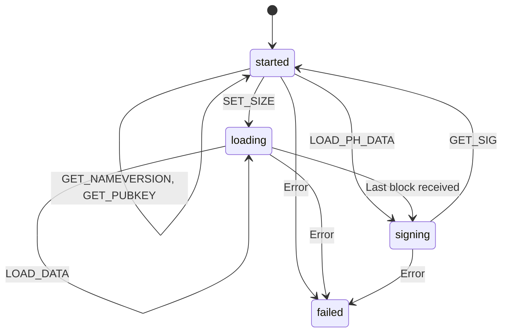

# Implementation notes

## Protocol state machine

The state machine below controls the protocol parser. Only a certain
number of commands are available in each state. The reasoning behind
it is to tighten the protocol and exit early on any errors.

We have four states:

- `started`
- `loading`
- `signing`
- `failed`

When we start the machine we start in state `started` and are ready
for some inital commands. See [README.md](../README.md) for a complete
description of the protocol and what we expect a well-behaved client
to do. The state machine is here to catch clients who are not that
well-behaved.

When we enter state `failed` we trigger an unimplemented instruction
and halt the CPU, blinking the status LED forever in hardware, and not
executing any more instructions until powercycling the TKey.

Protocol commands in the graph are marked with all caps, like this
`GET_NAMEVERSION`. In the code all commands are prefixed by `CMD_` but
that has been removed here to make it easier to follow. They have a
corresponding reply code `RSP_` which is not part of the protocol
parser and hence not mentioned here.

"Error" means any kind of error, either parsing errors (wrong length,
unexpected data, a firmware probe in a state that doesn't allow it) or
some other kind of error.

### State: started

Commands allowed in state `started`:

| *command*         | *next state* |
|-------------------|--------------|
| `GET_NAMEVERSION` | `started`    |
| `GET_PUBKEY`      | `started`    |
| `SET_SIZE`        | `loading`    |
| `LOAD_PH_DATA`    | `signing`    |

In `started` we're ready to start a transaction with a client program.
It can gather some information and start sending a message by setting
the size or directly sending a small 64 bytes pre-hashed message.

### State: loading

Commands allowed in state `loading`:

| *command*   | *next state*                         |
|-------------|--------------------------------------|
| `LOAD_DATA` | `loading` or `signing` on last chunk |

We're in the process of receiveing a message to be signed. All other
commands result in state failed. You can't go back to `started` until
you've sent the entire message and asked for a signature or powercycle
the TKey.

When we have received the entire message, as set by `SET_SIZE`, we
move to state `signing`.

One can argue that we should instead immediately sign and send back
the signature but that would break the current protocol which a lot of
clients are depending on.

### State: signing

Commands allowed in state `signing`:

| *command* | *next state* |
|-----------|--------------|
| `GET_SIG` | `started`    |

The entire message has been received. We're waiting for the client to
ask for the signature. No other commands are allowed. If they are
sent, even a firmware probe, we enter state `failed`.

When the request comes for a signature we first wait for the user to
assert presence by touching the touch sensor, then sign the message,
and send the signature back to the client. Then we go back to state
`started` to expect a new message to sign.

### State: failed

Commands in state `failed`: None.

Some error (parsing or otherwise) or wrong command has been seen. We
feed the CPU an illegal instruction and the hardware hangs forever,
blinking the LED red. We can only exit this state by powercycling the
TKey.
